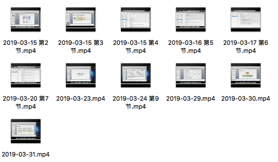
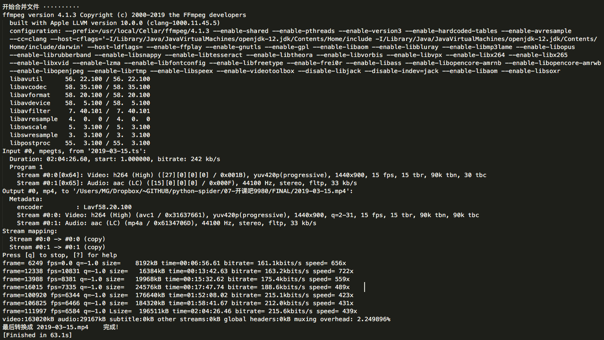

- 参考：[在线流视频m3u8文件解析，AES-128 - 简书](https://www.jianshu.com/p/dee16407a776)

### 下载视频

```
# 下载m3u文件 ---- 暂时手动下载 2019-04-10.m3u
# self.down_m3u(url?)

# 先得到key文件
# self.get_key()

# 再下载所有的ts文件
self.down_ts_all()

# 破解所有的ts ？？？会出错的，解码了DS_Store文件
# self.del_DS_Store(self.down_path)
# self.decrypt_all_ts()

# 合并文件，转为mp4
# self.del_DS_Store(self.decrypt_path)
# self.concat_ts()

# 最后删除加密的ts、破解的ts、m3u、key文件
# self.clear_ts_file()
```


- 解析m3u8文件

```
def get_m3u(self):
    m3u8_obj = m3u8.load('../{}.m3u'.format(self.down_date))
    return m3u8_obj
```


- 下载ts文件

```
def kaiKeBaBlock(self, key_url):      
    alter_param = 'cd12-c120'
    # alter_param = 'cd12-ccd1-2'
    base_url = 'https://{}.play.bokecc.com/flvs/7488FF1B7810DE53/{}/'.format(alter_param, self.down_date)
    url = base_url + key_url

    index = re.search(r'video=(\d*)', key_url).group(1) 
    filename = index.zfill(4)

    resp = self.session.get(url, headers=self.headers)
    with open(r'{}.ts'.format(filename), 'wb') as f:
        f.write(resp.content)
    print('下载完成-----第{}段'.format(index))
    time.sleep(0.2)
```


- 破解AES-128

```
def decrypt_single_ts(self, file_name, key, iv):
    raw = open(file_name, 'rb').read()
    data = raw

    cipher = AES.new(key, AES.MODE_CBC, iv=iv)
    plain_data = cipher.decrypt(data)

    open('{0}/{1}'.format(self.decrypt_path, file_name), 'wb').write(plain_data)
    print('file: ' + file_name + '\tsucceed!')
```


- 合并下载ts文件

```
def concat_ts(self): 
    # 指定输出文件名称
    output_file = os.path.join(self.final_path, '{}.mp4'.format(self.down_date))
    # 使用ffmpeg将ts合并为mp4
    os.chdir(self.decrypt_path)
    print("开始合并文件 ··········")
    os.system('cat *.ts > %s.ts'%(self.down_date))
    command = 'ffmpeg -i "%s.ts" -acodec copy -vcodec copy -absf aac_adtstoasc %s'%(self.down_date, output_file)
    # 指行命令
    os.system(command)
    print("最后转换成 {}.mp4\t完成！".format(self.down_date))
```


#### 待解决问题

- 多线程
- 得到真实的.mu38文件地址？


#### 文件夹说明

- `DOWN` 下载用`aes-128`加密的ts
- `DECRYPT` 破解后的ts文件
- `FINAL` 最终生mp4


### 效果图





